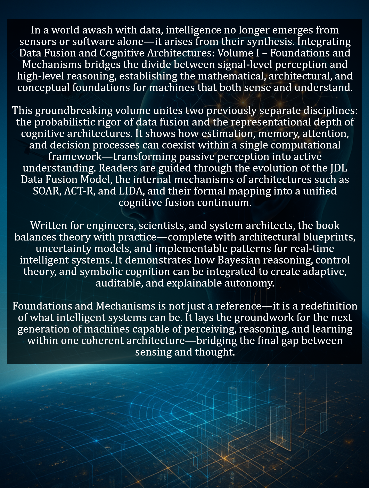

# Integrating Data Fusion And Cognitive Architectures

### Cover

### Repository Structure
- `covers/`: Book cover images
- `blurbs/`: Promotional blurbs
- `infographics/`: Marketing visuals
- `source_code/`: Code samples
- `manuscript/`: Drafts and format.txt for TOC
- `marketing/`: Ads and press releases
- `additional_resources/`: Extras

View the live site at [burstbookspublishing.github.io/integrating-data-fusion-and-cognitive-architectures](https://burstbookspublishing.github.io/integrating-data-fusion-and-cognitive-architectures/)
---

- Integrating Data Fusion and Cognitive Architectures
- VOLUME 1: Foundations and Mechanisms.         Chapters 1-16
- VOLUME 2: Applications and Future Directions. Chapters 17-33

---
## Chapter 1. The Fusion–Cognition Convergence
### Section 1. Why Now? Historical Context and Drivers
- Sensor proliferation, cheap compute, and ubiquitous connectivity since 2000
- Maturation of the JDL model alongside cognitive architectures (SOAR, ACT-R, etc.)
- Mission, safety, and compliance pressures demanding traceable decisions
- Data volume/velocity/variety outpacing classical pipelines

### Section 2. The Separate Worlds: Fusion vs. Cognition
- Fusion focus: estimation, association, and uncertainty management (L0–L3)
- Cognition focus: goals, memory, reasoning, and learning loops
- Tooling and culture split: signal processing vs. cognitive modeling
- Pain points at the boundary: semantics, temporal abstraction, intent

### Section 3. Convergence Forces: Technology, Markets, and Theory
- Deep nets + probabilistic inference + symbolic reasoning (neuro-symbolic)
- Edge/cloud orchestration enabling L0–L4 + user refinement at scale
- Market demand for explainability, assurance, and adaptive behavior
- Theoretical links: POMDPs, control, and cognitive control/attention

### Section 4. The Fusion–Cognition Continuum Framework
- Levels mapping: JDL (L0–L4) ↔ perception, working memory, control
- Data structures: tracks/graphs/ontologies ↔ episodes/chunks/embeddings
- Control surfaces: sensor management, policy switching, attention
- Hand-off patterns across L0–L4: when cognition should override fusion

---
## Chapter 2. The JDL Data Fusion Model
### Section 1. Origins and Evolution
- Early DARPA lineage and the Level 0–4 schema with later Level 5 addition
- Design goals, scope limits, and assumptions about uncertainty and structure
- Relationship to OODA, control theory, and enterprise decision loops

### Section 2. Level 0: Sub-Object Assessment
- Detection, denoising, calibration, and registration at the signal/feature layer
- SNR, clutter, and false-alarm control; windowing and CFAR patterns
- Examples: beamforming, STAP, voxel filtering, spectral unmixing

### Section 3. Level 1: Object Assessment
- Tracking, classification, and identification of entities/objects
- Filters and smoothers: KF/EKF/UKF/PF; data models and observability
- Track management: initiation, maintenance, termination, and identity fusion

### Section 4. Level 2: Situation Assessment
- Relational inference: spatial, temporal, and semantic context
- Graphs, ontologies, and event calculus for situation hypotheses
- Multi-entity interactions, formations, and activity patterns

### Section 5. Level 3: Impact Assessment
- Threat, risk, and mission impact scoring under uncertainty
- Utility, costs, and effect prediction; counterfactual reasoning
- Escalation logic, alerts, and decision support outputs

### Section 6. Level 4: Process Refinement
- Sensor/asset management and algorithm-policy selection
- Closed-loop adaptation using performance feedback and priors
- Scheduling under compute, bandwidth, and energy constraints

### Section 7. Level 5: User Refinement
- Human-in-the-loop preferences, intent, and interactive query
- Active learning and relevance feedback for model updating
- Explainers, summaries, and trust calibration

### Section 8. Critiques and Extensions
- Ambiguities between levels and temporal treatment gaps
- From pipeline to loop: control-theoretic and cybernetic views
- Data-centric AI, neuro-symbolic fusion, and ontology-grounded updates

---
## Chapter 3. Cognitive Architectures: The Reasoning Layer
### Section 1. What Is a Cognitive Architecture?
- Core subsystems: perception, working memory, long-term memory, learning, control
- Representations: symbolic, subsymbolic, and hybrid encodings
- Task models, bounded rationality, and performance metrics

### Section 2. SOAR: State, Operator, And Result
- Production rules and working memory organization
- Goal hierarchies, impasses, and subgoaling for problem solving
- Chunking as learning; implications for latency and scale

### Section 3. ACT-R: Adaptive Control of Thought—Rational
- Declarative vs procedural memory and activation dynamics
- Retrieval latency, noise, and utility-based choice
- Learning mechanisms and parameterization for real-time behavior

### Section 4. LIDA, Global Workspace, and Related Models
- Broadcast/competition dynamics and attentional mechanisms
- Episodic memory, affect, and salience in control loops
- Relevance to situation understanding and intent recognition

### Section 5. Comparative Criteria for Fusion Integration
- Real-time suitability, explainability, and verification needs
- Mapping to data structures (tracks, graphs, chunks, embeddings)
- Middleware fit (ROS 2/DDS), failure modes, and mitigation patterns

---
## Chapter 4. Mapping Fusion to Cognition: A Unified Blueprint
### Section 1. Level Mappings (JDL ↔ Cognitive Primitives)
- L0 ↔ perception; L1 ↔ object memory; L2 ↔ situation model
- L3 ↔ evaluation/utility; L4 ↔ meta-control; L5 ↔ user model
- Consistent interfaces and timing assumptions across levels

### Section 2. Data Structures and Messages
- Tracks, graphs, ontologies ↔ chunks, schemas, and embeddings
- Time, uncertainty, and provenance annotations as first-class fields
- ROS 2/DDS message patterns and QoS profiles for fusion-cognition IO

### Section 3. Control Surfaces and Policies
- Sensor management, scheduler hooks, and attentional gating
- Algorithm switching, resource budgets, and safety envelopes
- Conflict resolution and arbitration policies

### Section 4. Hand-off Patterns Across L0–L4
- When cognition should override or veto fusion outputs
- Hypothesis promotion/demotion and cross-level feedback
- Audit trails, logging, and traceability for assurance

### Section 5. Minimal Viable Cognitive Fusion Stack
- Core nodes/services, buffers, and shared memory abstractions
- Training/validation loop and golden-trace reuse
- Metrics to prove value: accuracy, latency, robustness, and trust

---
## Chapter 5. Level 0–1 Sensor & Signal Fusion
### Section 1. Modalities, Calibration, and Synchronization
- Camera/LiDAR/Radar/IMU/GNSS characteristics and complementary error modes
- Intrinsic/extrinsic calibration and temporal alignment (PTP/GPSDO/IMU sync)
- Registration spaces: pixel, range–bearing, ego frame, and world frame

### Section 2. Preprocessing and Featureization
- Denoising, deblurring, deskewing, and motion compensation
- Spectral/temporal filtering, CFAR, and background subtraction
- Feature stacks: keypoints, descriptors, learned embeddings, and uncertainty

### Section 3. Bayesian State-Space Foundations
- Process/measurement models; observability and identifiability
- Noise models (Gaussian, heavy-tailed, mixture) and robustness
- Latency, jitter, and out-of-sequence measurements (OOSM) handling

### Section 4. Filters and Smoothers (L0→L1)
- KF/EKF/UKF/PF selection criteria and stability considerations
- Smoothing (RTS/fixed-lag) and multi-rate fusion pipelines
- Practical tuning: covariances, gating radii, and innovation tests

### Section 5. Multi-Sensor Registration and Initialization
- Frame-to-frame, map-to-frame, and sensor-to-sensor alignment
- Bootstrapping tracks: detection logic, N-scan confirmation, and seeds
- Failure modes: miscalibration drift, time skew, and false-lock traps

---
## Chapter 6. Data Association
### Section 1. Gating and Scoring
- Elliptical/Mahalanobis gating and missed-detection control
- Likelihood, NLL, and learned similarity scores
- Clutter modeling and density estimation for realistic scenes

### Section 2. Assignment Algorithms
- Hungarian, auction, and min-cost flow formulations
- Multi-frame association (N-scan, tracklet stitching) and complexity trade-offs
- Deferred decisions vs immediate commits under latency budgets

### Section 3. Probabilistic Approaches
- JPDA/JIPDA for dense scenes; track coalescence mitigation
- MHT/LMHT and hypothesis tree pruning strategies
- RFS/GLMB/δ-GLMB and labeled multi-Bernoulli tracking

### Section 4. Identity and Re-Identification
- Appearance models, re-id embeddings, and cross-modal cues
- Identity persistence across occlusions and handoffs
- Open-set, long-tail, and look-alike management

### Section 5. Diagnostics and Metrics
- CLEAR MOT, HOTA, IDF1, and OSPA for association quality
- Ablations: gating radius, clutter rate, frame rate, and sensor mix
- Common pitfalls: overfitting to benchmarks and label leakage

---
## Chapter 7. Level 2 Situation Assessment
### Section 1. Relational Models and Graphs
- Entities, relations, and interaction patterns over space–time
- Dynamic graphs, message passing, and attention over neighborhoods
- Hypothesis generation vs confirmation and resource-aware search

### Section 2. Ontologies and Semantic Lifting
- Domain vocabularies, OWL/RDF schemas, and provenance tags
- Reasoners (DL/Lite) and rule engines for constraint checks
- Bridging numeric tracks to symbolic events and roles

### Section 3. Activities, Events, and Patterns
- Compositional event models and temporal templates
- Multi-agent activities (formations, pursuit, rendezvous)
- Anomaly categories: contextual, collective, and behavioral

### Section 4. Evaluation and Assurance at L2
- Situation accuracy, latency-to-detect, and false-context rates
- Calibration, counterfactual probes, and stress scenarios
- Hand-off artifacts for L3 impact assessment

---
## Chapter 8. Temporal Reasoning and Dynamics
### Section 1. Temporal Logics and Constraints
- Interval/point algebra, STL/LTL for safety and mission rules
- Temporal joins, windowing, and event alignment operators
- Consistency checks under jitter, dropouts, and resampling

### Section 2. Sequence Models
- HMM/HSMM and CRF for structured temporal labeling
- RNN/LSTM/GRU vs TCN for long-range dependencies
- Transformers with causal masks and streaming attention

### Section 3. Time Alignment and Uncertainty Propagation
- Asynchronous sensor fusion and skew-tolerant buffers
- Fixed-lag smoothing vs online filters under compute caps
- Propagating covariance and epistemic/aleatoric terms over time

### Section 4. Temporal Evaluation
- Detection delay, time-to-stability, and robustness-to-gaps
- Segment- and event-level metrics; calibration over horizons
- Failure analysis: drift, covariate shift, and non-stationarity

---
## Chapter 9. Level 3 Cognitive Scenario Recognition
### Section 1. From Situations to Scenarios
- Elevating L2 contexts into hypotheses about plans, goals, and outcomes
- Evidence graphs: chaining events, preconditions, and causal links
- Hypothesis lifecycle: spawn, compete, merge, retire

### Section 2. Intent and Goal Inference
- Inverse planning/POMDP formulations under partial observability
- Utility models, constraints, and tactic libraries per domain
- Ambiguity management: multi-intent posteriors and tie-breaking

### Section 3. Neuro-Symbolic Composition
- Learned perception + symbolic rules/templates over event graphs
- Program induction and differentiable logic for scenario scoring
- Robustness via invariants, unit checks, and counterexamples

### Section 4. LLM-Assisted Reasoning (Guardrailed)
- Text grounding: schema-constrained prompting over structured context
- Retrieval windows, tool use, and refusal policies for safety
- Latency/SLO budgeting and deterministic fallbacks

### Section 5. Scenario Evaluation
- Precision/recall over scenarios, timeliness, and false-escalation rates
- Stress suites: rare events, concept drift, and adversarial behavior
- Auditables: rationale traces, rule hits, and sensitivity slices

---
## Chapter 10. Level 4 Adaptive Fusion Control
### Section 1. Control Surfaces and Levers
- Sensor tasking, frame rates, beam steering, and region-of-interesting
- Algorithm selection, parameter tuning, and model hot-swap
- Budget partitions: compute, bandwidth, energy, and operator attention

### Section 2. Policy Learning and Selection
- Contextual bandits vs RL; off-policy evaluation under safety bounds
- Meta-learning across environments; cold-start strategies
- Confidence-aware switching with hysteresis and dwell times

### Section 3. Schedulers and Resource Arbitration
- Multi-queue priority schemes and deadline monotonic patterns
- Graceful degradation modes and bounded staleness
- Admission control and overload protection

### Section 4. Safety, Assurance, and Governance
- Guarded actions behind formal checks and simulators-in-the-loop
- Canarying, rollback, and blast-radius containment
- Policy provenance, approvals, and SOX/ISO audit hooks

### Section 5. Telemetry and Feedback
- KPIs for control: reward, regret, duty cycle, and SLA adherence
- Telemetry design: counters, histograms, traces, and exemplars
- Online A/B of control policies with interleaving

---
## Chapter 11. Memory Systems and Fusion Buffers
### Section 1. Working Memory and Temporal Buffers
- Sliding windows, fixed-lag stores, and time-indexed access
- Ordering, watermarking, and out-of-order reconciliation
- Eviction policies tuned to scenario horizons

### Section 2. Long-Term Memory and Knowledge Stores
- Tracks→episodes→schemas; retention and compaction strategies
- Graph/columnar hybrids for queries at scale
- Provenance, lineage, and signed attestations

### Section 3. Caching and Materialization
- View caches for common joins and cross-level lookups
- Hot-path materialization to cut p99 latency
- Consistency models: eventual, bounded-stale, and read-your-writes

### Section 4. Persistence, Checkpointing, and Recovery
- Snapshotting stateful operators and log-structured storage
- Crash-only design with idempotent replays
- Disaster recovery RPO/RTO targets and drills

### Section 5. Failure Modes and Hardening
- Memory leaks, unbounded growth, and thundering replays
- Skewed keys, hotspot entities, and shard imbalance
- Data corruption detection and auto-quarantine

---
## Chapter 12. Software Architecture Foundations
### Section 1. Process Topology and Decomposition
- Node composition vs nodelets; pipes-and-filters vs actors
- Bounded contexts and anti-corruption layers around legacy
- State isolation to contain faults and ease upgrades

### Section 2. Messaging and QoS (ROS 2/DDS)
- QoS profiles: reliability, durability, history, and deadline
- Back-pressure, flow control, and zero-copy pathways
- IDL/schema discipline, versioning, and compatibility

### Section 3. Real-Time and Determinism
- Priority inheritance, CPU pinning, and NUMA awareness
- Executor models, timer jitter control, and schedulability
- Clock sources, time synchronization, and monotonicity

### Section 4. Dataflow Patterns and Interfaces
- Pub/sub, request/response, and async task orchestration
- Sidecar services for validation, rate-limit, and explainers
- Interface contracts: schemas, SLAs, and health endpoints

### Section 5. Packaging, Testing, and Release
- Build graph hygiene, reproducible containers, and SBOMs
- Unit→prop→HIL→field gates; golden-trace regression
- Rollout plans: blue/green, canary, and staged geos

---
## Chapter 13. ROS 2 Cognitive Fusion Framework
### Section 1. Node Graph and Composition
- Core fusion nodes (L0–L4), cognition services, and shared buffers
- Composition vs separate processes for isolation and latency control
- Lifecycle nodes, startup order, and health-check dependencies

### Section 2. Interfaces, Schemas, and Namespacing
- Message definitions for tracks, situations, and rationales
- Namespaces, remapping, and tf trees across multi-robot fleets
- Versioning, deprecation windows, and schema compatibility tests

### Section 3. Launch, Parameters, and Configuration
- Launch files for topology, QoS, and per-environment overrides
- Parameter servers, dynamic reconfigure, and safety locks
- Secrets handling and environment-variable discipline

### Section 4. QoS Discipline and Reliability
- Reliability, history depth, and deadline settings by stream criticality
- Back-pressure, loss recovery, and bounded-staleness handshakes
- Recording/replay hooks for golden-trace debugging

### Section 5. Observability and Debugging
- Structured logs, traces, and metrics for fusion–cognition paths
- Introspection tools, message sniffers, and event timelines
- Offline notebooks and dashboards for issue triage

---
## Chapter 14. Simulation and Testing
### Section 1. Simulation Stack and Fidelity
- Sensor, dynamics, and environment models aligned to target domains
- Abstaction layers to swap simulators without code churn
- Calibration of sim-to-real gaps with measured artifacts

### Section 2. Scenario Generation and Coverage
- Handcrafted edge cases, fuzzed scenes, and counterfactuals
- Distributional coverage: weather, density, behaviors, and faults
- Seeds, determinism, and reproducible randomization

### Section 3. Hardware-in-the-Loop and SIL/MIL
- Signal injection, timing closure, and latency budgets
- Golden-trace loops for regression and drift detection
- Safe fault-insertion and rollback procedures

### Section 4. CI Pipelines and Gates
- Unit → property → integration → system → HIL stages
- Flake control, quarantine lanes, and rerun economics
- Performance baselines and release-blocking thresholds

### Section 5. Test Oracles, Labels, and Metrics
- Auto-oracles from constraints and invariants
- Label strategies: weak, synthetic, active, and human-in-the-loop
- Quality dashboards for accuracy, latency, robustness, and safety

---
## Chapter 15. Edge Deployment and Optimization
### Section 1. Targets, Constraints, and Budgets
- Embedded SOCs, GPUs/NPUs, and thermal/energy ceilings
- Latency SLOs, frame budgets, and memory footprints
- Degradation modes and minimum viable perception

### Section 2. Model and Graph Optimization
- Pruning, distillation, quantization, and operator fusion
- ONNX/TensorRT conversion and calibration workflows
- Mixed precision, sparsity, and kernel autotuning

### Section 3. Runtime Scheduling and Priorities
- Real-time executors, stream priorities, and pinned cores
- Co-scheduling perception, association, and cognition loops
- Deadline monitors and watchdog resets with safe fallbacks

### Section 4. I/O, Storage, and Networking
- DMA/zero-copy paths, ring buffers, and lock-free queues
- Bounded logging, local caching, and writeback policies
- Link adaptation, retries, and congestion control

### Section 5. Profiling, Telemetry, and Field Debug
- Hot-path tracing, flame graphs, and percentile latency
- On-device logging/telemetry budgets and sampling
- Remote diagnostics, snapshots, and redaction discipline

---
## Chapter 16. Cloud-Native Fusion Systems
### Section 1. Streaming, Storage, and Serving
- Ingest (pub/sub), feature stores, and long-horizon archives
- Batch vs streaming analytics for model and policy updates
- Retrieval APIs for audit, replay, and counterfactuals

### Section 2. Microservices and Dataflow
- Stateless vs stateful operators and scaling patterns
- Exactly-once/at-least-once semantics and idempotent design
- Schema registry, contracts, and backward compatibility

### Section 3. Orchestration and Reliability
- Workload placement, autoscaling, and bin-packing
- Circuit breakers, bulkheads, and graceful degradation
- Chaos testing for network, node, and dependency failures

### Section 4. Security, Privacy, and Compliance
- AuthN/Z, key management, and encrypted channels at rest/in transit
- PII minimization, provenance, and tamper-evident logs
- Policy enforcement and region/tenant isolation

### Section 5. Cost, SLOs, and Governance
- Cost per scenario/decision and efficiency scorecards
- SLO drafting: latency, availability, freshness, and explainability
- Change management, approvals, and audit-ready releases

---
## Chapter 17. Domain Playbook: Autonomous Vehicles
### Section 1. Operational Goals and Hazards
- Plan, localize, and navigate urban/suburban roads with bounded risk
- Handle edge cases: occlusions, jaywalkers, cut-ins, and rare weather
- Meet safety envelopes: stopping distance, TTC, and fallback behaviors

### Section 2. Sensor Suite and Limits
- Camera/LiDAR/Radar/IMU/GNSS with redundancy and thermal constraints
- Failure modes: saturation, blooming, multipath, wheel slip
- Calibration persistence across shocks, temperature, and service cycles

### Section 3. Fusion Stack (L0–L4)
- L0–L1: ego-motion + object tracks with lane/curb geometry fusion
- L2: scene graph (lanes, traffic controls, agents, right-of-way)
- L3: intent/interaction modeling (yield/merge/over-take)
- L4: sensor tasking, model selection, and map refresh policies

### Section 4. Cognition Loop
- Goal hierarchy: navigation → path → behavior → actuation
- Attention to occlusion zones and vulnerable road users
- Rule arbitration: traffic code vs learned priorities

### Section 5. Validation and Metrics
- Disengagements, infractions, comfort, and rare-event recall
- Closed-course, sim-at-scale, and shadow-mode comparisons
- Safety cases with traceability and evidence catalogs

### Section 6. Incidents and Failure Modes
- Perception dropouts, stale maps, and misclassified signals
- Interaction deadlocks and unmodeled agent behaviors
- Recovery trees, minimum risk maneuvers, and handover

### Section 7. Mini Case
- Unprotected left turn with pedestrian emergence at dusk

---
## Chapter 18. Domain Playbook: Smart Homes and Assistive Robotics
### Section 1. Operational Goals and Hazards
- Reliable assistance (fetch, clean, reminders) in cluttered homes
- Privacy preservation and safe human–robot proximity
- Non-stationary layouts, pets/children, and device idiosyncrasies

### Section 2. Sensor Suite and Limits
- RGB-D, tactile/force, microphone arrays, BLE/IoT beacons
- Limits: specular floors, soft-body grasping, reverberant speech
- Routine self-check calibration and auto-recovery prompts

### Section 3. Fusion Stack (L0–L4)
- L0–L1: mapping/SLAM + graspable-object tracking
- L2: room/affordance semantics and activity contexts
- L3: task plans with user-preference priors
- L4: policy switching by time-of-day, resident, and energy budget

### Section 4. Cognition Loop
- Goal inference from routines and lightweight dialogue acts
- Memory for object placement and user-specific constraints
- Social compliance and interruption handling

### Section 5. Validation and Metrics
- Task success, time-to-complete, and assist burden reduction
- Speech-under-noise and grasp success under variability
- Privacy/consent audits and local-only processing rates

### Section 6. Incidents and Failure Modes
- Confusable commands, reflective floors, and fragile objects
- Pet/child interference and blocked charge docks
- Safe-stop envelopes and user notification pathways

### Section 7. Mini Case
- “Find my glasses” with room-level search and dialogue refinement

---
## Chapter 19. Domain Playbook: C2 / ISR and Defense
### Section 1. Operational Goals and Hazards
- Persistent awareness, target development, and time-critical decisions
- Deception, spoofing, and contested/denied environments
- Rules of engagement, collateral constraints, and escalation control

### Section 2. Sensor Suite and Limits
- EO/IR, SAR/GMTI, EW/ESM, AIS/ADS-B, HUMINT/OSINT
- Limits: comms intermittency, look-angle restrictions, weather
- Cross-platform alignment and latency-aware dissemination

### Section 3. Fusion Stack (L0–L4)
- L0–L1: multi-INT track/ID with emitter correlation
- L2: order of battle, formations, and activity patterns
- L3: intent/threat and course-of-action hypotheses
- L4: sensor/asset tasking under bandwidth and risk budgets

### Section 4. Cognition Loop
- Hypothesis management with evidence weighting and counterfactuals
- Human-on-the-loop approvals and red/blue/adversarial models
- Confidence-aware alerts and rationale summaries

### Section 5. Validation and Metrics
- Track purity, latency-to-cue, and mission outcome uplift
- Robustness to deception and sensor loss
- Audit logs, chain-of-custody, and reproducible rationale

### Section 6. Incidents and Failure Modes
- Identity swaps, decoys, and clutter-induced escalations
- Broken dissemination paths and stale intel fusion
- Graceful degradation playbooks and hold-fire safeguards

### Section 7. Mini Case
- Maritime rendezvous with AIS spoofing and SAR revisit gaps

---
## Chapter 20. Domain Playbook: Healthcare and Clinical AI
### Section 1. Operational Goals and Hazards
- Early detection, triage support, and workflow efficiency
- High stakes: false negatives, alarm fatigue, and bias risks
- Compliance, consent, and PHI minimization

### Section 2. Sensor Suite and Limits
- Vitals, wearables, imaging, labs, EHR streams, clinician notes
- Limits: heterogeneity, missingness, drift from practice changes
- Device calibration, timestamp fidelity, and identity linkage

### Section 3. Fusion Stack (L0–L4)
- L0–L1: signal cleaning + patient-state estimation
- L2: condition/syndrome hypotheses over multimodal evidence
- L3: risk/impact (deterioration, readmission, complications)
- L4: alert thresholds, cohort selection, and active testing

### Section 4. Cognition Loop
- Clinician-in-the-loop decision support with explanations
- Preference-aware plans, contraindications, and shared decision making
- Uncertainty displays and “why not alerted?” rationale

### Section 5. Validation and Metrics
- AUROC/PPV at alert volumes clinicians can sustain
- Calibration, subgroup fairness, and shift-resilience
- Silent trials, phased rollouts, and post-market surveillance

### Section 6. Incidents and Failure Modes
- Data linkage errors, device drift, and guideline changes
- Alert floods and desensitization; automation bias
- Overrides, second-look policies, and escalation paths

### Section 7. Mini Case
- Sepsis early warning with labs, vitals, and nursing notes

---
## Chapter 21. Domain Playbook: Industrial & Smart Cities
### Section 1. Operational Goals and Hazards
- Throughput, yield, and OEE improvement with bounded downtime windows
- Worker safety, lockout/tagout integrity, and proximity risks
- Utility reliability, demand spikes, and cascading failures across assets

### Section 2. Sensor Suite and Limits
- Vibration, thermography, power quality, PLC/SCADA tags, CCTV, traffic/air quality
- Limits: sensor drift, EMI, occlusions, seasonal cycles, policy redactions
- Asset identity linkage across CMMS, BIM/GIS, and telemetry namespaces

### Section 3. Fusion Stack (L0–L4)
- L0–L1: condition indicators + object/event tracks for assets, people, vehicles
- L2: site/city situation graphs (zones, flows, hazards, emissions)
- L3: impact on safety, uptime, SLAs, and environmental compliance
- L4: tasking sensors, rerouting flows, and dynamic work orders

### Section 4. Cognition Loop
- Multi-objective planning (safety → production → energy → emissions)
- Preference/priority models per shift, zone, and regulation
- Coordination with human operators and automated substations

### Section 5. Validation and Metrics
- MTBF uplift, downtime reduction, false alarm rate, and maintenance precision
- Traffic KPIs: delay, queue length, emergency preemption success
- Environmental KPIs: exceedance detection, time-to-mitigation

### Section 6. Incidents and Failure Modes
- Sensor dropouts, PLC tag changes, data skew, and silent unit swaps
- Conflicting objectives (throughput vs safety vs energy)
- Playbooks for safe fallback, manual override, and audit capture

### Section 7. Mini Case
- Heatwave event: load shedding + traffic retiming + HVAC fault isolation

---
## Chapter 22. Fusion-Specific Metrics and Diagnostics
### Section 1. Detection and Tracking Quality
- PD, FAR, ROC/PR; MOTA/MOTP, HOTA, IDF1, CLEAR MOT
- OSPA/OSPA2 distances and cardinality errors
- Track purity, fragmentation, and life-cycle health

### Section 2. Association and Identity
- Gating hit rate, re-id accuracy, switch frequency, and coalescence
- Hypothesis tree growth vs prune ratio (MHT/JIPDA)
- Ablations: clutter rate, frame rate, sensor mix, and latency

### Section 3. Situation Assessment (L2)
- Scene graph precision/recall, interaction accuracy, time-to-detect
- Ontology consistency, constraint violations, and reasoner coverage
- Robustness under dropouts, spoofing, and distribution shift

### Section 4. Uncertainty and Calibration
- Reliability diagrams, ECE/MCE, CRPS, NLL, Brier
- Covariance validity tests and NIS/NEES consistency
- Epistemic vs aleatoric attribution and confidence gating

### Section 5. Test Artifacts and Protocols
- Golden traces, seed control, and replay determinism
- Label quality audits (noise, bias, drift)
- Metrics cards with thresholds, caveats, and owner sign-off

---
## Chapter 23. Cognitive Metrics: Reasoning, Explanation, and Human Factors
### Section 1. Reasoning Accuracy and Timeliness
- Scenario precision/recall, decision latency, and escalation correctness
- Counterfactual validity and causal sufficiency checks
- Sensitivity to missing/contradictory evidence

### Section 2. Goal/Intent Inference
- Inverse planning score, goal posterior calibration, tie-break quality
- Policy conformity to constraints and preferences
- Ambiguity handling and deferral discipline

### Section 3. Explanation and Transparency
- Faithfulness, completeness, and stability under small perturbations
- Rationale trace quality, rule hits, and provenance coverage
- User-rated clarity, actionability, and cognitive load

### Section 4. Human-in-the-Loop Outcomes
- Alert acceptance, override rates, and assisted success uplift
- Workload (NASA-TLX), trust calibration, and learning curve
- Safety impacts and near-miss reductions

### Section 5. Learning and Adaptation
- Sample efficiency, regret, and safe exploration budget
- Forgetting/transfer metrics across domains and seasons
- Drift detection lead time and recovery speed

---
## Chapter 24. System-Level KPIs, Safety, and Assurance
### Section 1. Performance and Reliability
- Latency (p50/p95/p99), throughput, and backpressure incidence
- Availability (SLOs), MTTR/MTBF, and dependency budgets
- Capacity headroom and cost-to-serve per decision

### Section 2. Safety and Risk Management
- Hazard analysis coverage, safety case completeness, and proof debt
- Guarded actions, interlocks, and bounded-staleness controls
- Incident taxonomy, near-miss capture, and corrective action latency

### Section 3. Security and Privacy
- AuthN/Z coverage, key hygiene, and tamper-evidence rates
- PII minimization, data residency, and differential exposure
- Red-team findings, patch SLAs, and supply-chain attestations

### Section 4. Compliance and Governance
- Policy alignment (industry/region), audit trail integrity, retention
- Model/policy change control, approvals, and rollback readiness
- KPIs for explainability, fairness, and stakeholder sign-off

### Section 5. Operability and Observability
- Telemetry cardinality, exemplars, and trace completeness
- SLO error budgets, burn rates, and autoscaling health
- Runbook maturity, on-call toil, and MTTD/MTTR improvements

---
## Chapter 25. Evaluation Programs, Benchmarks, and Testbeds
### Section 1. Experiment Design and Protocols
- Hypotheses, success criteria, and fixed analysis plans
- Scenario libraries, counterfactual probes, and stress suites
- Randomization, blocking, and leakage prevention

### Section 2. Benchmarks and Datasets
- Public vs private corpora; licensing, bias, and drift audits
- Synthetic-to-real strategies and domain randomization
- Data cards: provenance, splits, and intended use

### Section 3. Testbeds and Environments
- SIL/MIL/HIL rigs, sensor emulators, and hardware proxies
- Closed-course, shadow-mode, and phased field trials
- Safety harnesses, kill switches, and rollback tooling

### Section 4. Reporting and Reproducibility
- Metrics cards, confidence intervals, and error bars
- Seed control, version pinning, and artifact registries
- Result interpretability, caveats, and owner sign-off

---
## Chapter 26. Human-in-the-Loop Fusion
### Section 1. Roles, Interfaces, and Workflows
- Operator tasks, escalation ladders, and deferral policies
- UI/UX for uncertainty, rationale, and alternative actions
- Cognitive load management and alert hygiene

### Section 2. Active Learning and Preference Elicitation
- Query strategies (uncertainty, diversity, impact-weighted)
- Weak labels, corrections, and policy feedback loops
- Preference models, trade-off sliders, and guardrails

### Section 3. Trust, Explanation, and Training
- Explanation types: factual, contrastive, counterfactual
- Skill acquisition, drills, and simulator practice
- Measuring trust calibration and overreliance risks

### Section 4. Governance and Accountability
- Approval chains, audit logs, and role-based access
- Incident review, corrective actions, and learnings capture
- Ethical boundaries, dual-use controls, and consent

---
## Chapter 27. Neuro-Symbolic and LLM-Augmented Fusion
### Section 1. Composition Patterns
- Perception nets feeding symbolic rules over event graphs
- Constraint solvers with learned scoring functions
- Tool-using LLMs gated by schemas and policies

### Section 2. Guardrails and Reliability
- Schema-constrained prompting and function calling
- Deterministic fallbacks, abstention, and refusal handling
- Robustness tests: perturbations, jailbreaks, and red-teaming

### Section 3. Cost, Latency, and Footprint
- Token/throughput budgets and on-device distillation
- Caching, retrieval windows, and memoization
- SLA design for hybrid pipelines (neural + symbolic)

### Section 4. Evaluation of Hybrid Reasoners
- Faithfulness vs usefulness; invariance checks
- Counterfactual tasks and grounded QA over traces
- Long-horizon consistency and error localization

---
## Chapter 28. Embodied and Grounded Cognitive Fusion
### Section 1. Perception–Action Loops
- Closing the loop: sensing, understanding, planning, acting
- Affordances and task-relevant representations
- Safety envelopes and conservative execution

### Section 2. Spatial and Semantic Grounding
- Maps, scene graphs, and object-centric memory
- Language→action grounding and instruction following
- Persistent anchors, landmarks, and uncertainty tags

### Section 3. Learning in the World
- Policy learning with sim2real and curriculum design
- Self-supervision from interaction and corrective feedback
- Continual learning, replay buffers, and safeguards

### Section 4. Benchmarks and Field Trials
- Embodied tasks: navigation, manipulation, and collaboration
- Metrics: success rate, efficiency, resets, and violations
- Reporting real-world constraints and maintenance load

---
## Chapter 29. Security and Adversarial Resilience
### Section 1. Threat Models and Attack Surfaces
- Sensor-layer: spoofing, jamming, blinding, and saturation
- Data-layer: poisoning, label leakage, and drift injection
- Model/pipeline: adversarial examples, backdoors, and prompt attacks

### Section 2. Detection, Hardening, and Response
- Out-of-distribution and anomaly sentinels with calibrated abstention
- Ensemble checks, redundancy, and cross-modal corroboration
- Containment: quorums, rate limits, and privilege separation

### Section 3. Provenance, Integrity, and Traceability
- Signed telemetry, attestations, and tamper-evident logs
- Secure time, sequence numbers, and watermarking
- Chain-of-custody from raw capture to decision artifacts

### Section 4. Red Teaming and Chaos Security
- Attack libraries, replay benches, and adversarial sims
- Fault/jam drills with kill switches and rollback trees
- Metrics: detection lead time, blast radius, and recovery MTTR

### Section 5. Privacy-Preserving Fusion
- On-device processing, minimization, and selective retention
- Differential privacy, secure enclaves, and federated learning
- Policy constraints: regional residency and purpose limitation

---
## Chapter 30. Ethics, Safety, and Societal Implications
### Section 1. Principles and Harms
- Beneficence, non-maleficence, autonomy, and justice
- Misuse risks, chilling effects, and disparate impacts
- Human dignity in surveillance and assistive contexts

### Section 2. Bias, Fairness, and Equity
- Dataset coverage, subgroup performance, and error asymmetry
- Procedural fairness vs outcome fairness trade-offs
- Mitigations: reweighting, constraints, and impact assessments

### Section 3. Transparency, Consent, and Oversight
- Notice, opt-out paths, and data subject rights
- Model cards, system cards, and decision rationales
- Independent audits, stakeholder boards, and incident reporting

### Section 4. Safety Cases and Assurance
- Hazard analyses, claims–evidence arguments, and proof debt
- Safe states, bounded staleness, and escalation ladders
- Periodic review, recertification, and deprecation windows

### Section 5. Dual-Use and Export Controls
- Capability containment and region/role gating
- Governance for simulation assets and synthetic data
- Compliance with sector and national regimes

---
## Chapter 31. Open Challenges
### Section 1. Semantics at Scale
- Ontology evolution without brittleness or regressions
- Cross-domain transfer with minimal relabeling
- Grounding symbols to noisy, partial observations

### Section 2. Continual and Lifelong Fusion
- Non-stationarity, rehearsal budgets, and catastrophic forgetting
- Safe adaptation with guarantees on latency and accuracy
- Rapid onboarding for new sensors and behaviors

### Section 3. Causality and Counterfactuals
- From correlations in fused streams to causal structure
- Interventions, invariants, and do-calculus in practice
- Counterfactual evaluation aligned with safety cases

### Section 4. Verification and Validation
- Scalable property checking for hybrid neuro-symbolic stacks
- Coverage metrics that matter for risk, not only accuracy
- Formal–statistical hybrids for real-time guarantees

### Section 5. Human–AI Teaming
- Calibrated trust and workload management
- Explainability that drives correct operator action
- Training, recency, and skills retention

---
## Chapter 32. Research Roadmap
### Section 1. Short Horizon (0–12 months)
- Standard schemas for tracks, situations, and rationales
- Benchmarks coupling fusion accuracy with cognitive utility
- Reference ROS 2 graphs and golden-trace libraries

### Section 2. Mid Horizon (1–3 years)
- Unified uncertainty across neural, symbolic, and control layers
- Real-time neuro-symbolic planners with safety monitors
- Secure, privacy-preserving multi-party fusion protocols

### Section 3. Long Horizon (3–7 years)
- Generalizable world models for open-world fusion
- Self-maintaining ontologies with human-in-the-loop governance
- Certified learning systems with continuous assurance

### Section 4. Tooling and Infrastructure
- Reproducible pipelines, SBOMs, and artifact registries
- Sim2real validators, seed discipline, and fault injectors
- Open corpora with provenance, constraints, and ethics reviews

### Section 5. Community and Standards
- Interop working groups across academia/industry/regulators
- Shared metric suites linking performance, safety, and fairness
- Publication norms for incident disclosure and lessons learned

---
## Chapter 33. Conclusion and Practitioner Checklists
### Section 1. The Fusion↔Cognition Rosetta Summary
- Level mapping (L0–L5) to cognitive primitives and data structures
- Core interfaces, timing assumptions, and control surfaces
- Minimal viable stack and when to extend

### Section 2. Go-Live Readiness Checklist
- Accuracy, latency, robustness, and safety gates met
- Observability, on-call runbooks, and rollback paths
- Security posture, privacy controls, and compliance sign-offs

### Section 3. Operations and Continuous Improvement
- Telemetry reviews, drift monitors, and weekly audits
- A/B and interleaving for policy and model changes
- Post-incident reviews and proof-debt burn down

### Section 4. Investing for the Next Iteration
- Data quality programs and golden-trace refresh cadence
- Hiring profiles and training plans for fusion–cognition teams
- Roadmap alignment with risk, ROI, and societal commitments
- Appendix A. Mathematical Foundations

### Section 1. Probability and Statistics
- Random variables, moments, and common distributions
- Conditional probability, Bayes’ rule, and conjugacy
- Estimation theory: MLE, MAP, CRLB, and confidence intervals

### Section 2. Linear Algebra and Geometry
- Vector spaces, norms, and orthogonality
- Eigenvalues/eigenvectors, SVD, and PCA intuition
- Projections, least squares, and pseudo-inverses

### Section 3. State-Space Models and Inference
- Markov processes, Gaussian linear models, and innovations
- Kalman filter/smoother equations and stability
- Nonlinear extensions: EKF, UKF, and particle methods

### Section 4. Optimization Essentials
- Convexity, KKT conditions, and duality
- Gradient methods, line search, and convergence basics
- Stochastic optimization and regularization

### Section 5. Information Theory and Uncertainty
- Entropy, KL divergence, and mutual information
- Bits-back intuition, MDL, and coding arguments
- Calibration metrics and scoring rules

### Section 6. Graphs, Logic, and Reasoning
- Graph basics, message passing, and factorization
- Temporal/constraint logics for safety properties
- Soundness, completeness, and decidability notes
- Appendix B. Reference Pseudocode and Templates

### Section 1. Notation and Conventions
- Symbols, indices, and time-step conventions used across algorithms
- Random variable vs estimate marks; covariance and uncertainty tags
- Message/IO contract shape: inputs, outputs, and side effects

### Section 2. Filters and Estimators
- Kalman filter (linear Gaussian) update loop with innovation tests
- EKF/UKF templates with Jacobian/sigma-point helpers
- Particle filter resampling patterns and degeneracy checks

### Section 3. Association and Tracking
- Gating + cost matrix construction for detections→tracks
- Hungarian/auction assignment wrapper with tie-handling
- Track lifecycle: initiate/confirm/maintain/terminate states

### Section 4. Situation and Event Reasoning
- Scene graph construction and incremental message passing
- Rule/constraint evaluation with violation reporting
- Event template matching and hypothesis scoring

### Section 5. Control and Scheduling
- Sensor tasking policy loop with budget and dwell timers
- Algorithm hot-swap with hysteresis and cooldown
- Graceful degradation and minimum-viable perception path

### Section 6. Diagnostics and Telemetry
- Structured logging fields, counters, and exemplars
- Replay hooks and golden-trace capture utilities
- Health checks, watchdogs, and backoff strategies
- Appendix C. Code Repositories

### Section 1. ROS 2 Fusion Examples
- Repository layout (packages, launch, msg definitions)
- Minimal L0–L4 node graph with sample params
- Golden-trace recording/replay and tests
- Build/run instructions and pinned ROS 2 distro

### Section 2. PyTorch Multi-Modal Networks
- Data loaders and collators for multi-sensor inputs
- Model zoo (early/late/deep fusion baselines)
- Training scripts, configs, and metrics logging
- Export to ONNX/TensorRT and inference harness

### Section 3. SOAR Integration Examples
- State/WM interface for tracks, situations, and goals
- Production rules for scenario templates and responses
- Chunking/learning demos with evaluation hooks
- Bridge nodes to ROS 2 topics and services

### Section 4. Benchmark Evaluation Scripts
- Metric calculators (tracking, L2/L3, calibration)
- Seed control, artifact registry, and CI workflow
- Report generation (tables, plots, scorecards)
- Reproducibility notes and version pins
- Appendix D. Dataset Catalog

### Section 1. Autonomous Driving Datasets
- Modalities, sensor rigs, and geographic coverage
- Splits, licensing, and intended-use constraints
- Label taxonomies and quality notes
- Known biases, drift, and safety caveats

### Section 2. Robotics Datasets
- Manipulation/nav tasks and environment diversity
- Sensing formats (RGB-D, force/torque, proprioceptive)
- Episode structure, resets, and success criteria
- Sim2real alignment and calibration artifacts

### Section 3. Healthcare Datasets
- Data types (vitals, imaging, labs, notes) and PHI flags
- Cohort selection, de-identification, and governance
- Label provenance and clinical endpoints
- Ethical use, shift sensitivity, and audit trails

### Section 4. General Multi-Modal Datasets
- Modal combinations (vision–audio–text–tabular)
- Synchronization, timestamps, and missingness patterns
- Benchmark tasks and evaluation protocols
- License compatibility and redistribution terms
- Appendix E. Tool and Framework Reference

### Section 1. Sensor Fusion Libraries
- Filtering/estimation stacks and data association tools
- Tracking frameworks and uncertainty utilities
- Format converters and time-sync helpers
- Strengths, limits, and interoperability notes

### Section 2. Cognitive Architecture Implementations
- Core components (WM, LTM, rules, scheduler)
- Integration surfaces (APIs, messaging, embeddings)
- Real-time suitability and explainability features
- Typical pitfalls and debugging aids

### Section 3. Deep Learning Frameworks
- Training loops, mixed precision, and distributed modes
- Export/backends (ONNX, TensorRT, runtimes)
- Profilers, debuggers, and monitoring tools
- Long-term support and ecosystem maturity

### Section 4. Simulation Platforms
- Physics fidelity, sensor models, and plugin ecosystem
- Scenario authoring, determinism, and seed control
- HIL/SIL adapters and logging/replay
- Performance, scaling, and cost considerations

### Section 5. Visualization Tools
- 2D/3D scene views, overlays, and time scrubbers
- Graphs, traces, and metric dashboards
- Telemetry ingestion and live inspection
- Export formats and collaboration features
- Appendix F. Notation and Terminology

### Section 1. Mathematical Notation Guide
- Random variables, estimates, and covariance symbols
- Frames, poses, and coordinate conventions
- Time indices, delays, and lag notation
- Uncertainty: epistemic vs aleatoric marks

### Section 2. Acronym Glossary
- Core fusion terms (KF, EKF, JPDA, MHT, RFS, OSPA)
- Systems/RT terms (SLA, QoS, HIL, SIL, SBOM)
- Cognitive terms (WM, LTM, GWM, ACT-R, SOAR)
- Safety/security terms (FAR, MTBF, MTTR, DP)

### Section 3. Terminology Index
- Canonical definitions with chapter cross-references
- Synonyms and disambiguations used in the text
- Symbols table for common variables
- Units and preferred SI usage
---
